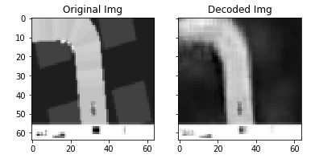
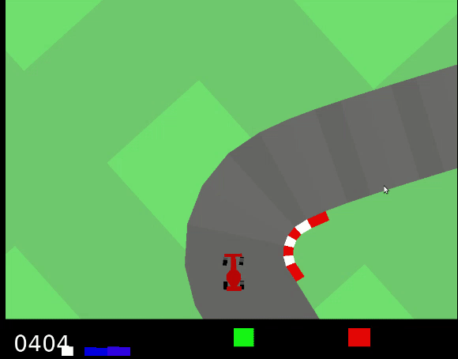

# World Models with PyTorch
A new version of world models using Echo-state networks and random weight-fixed CNNs in Pytorch. Also, the controller leverages RL algorithms, e.g. PPO methods.

# Requirement
To run the code, you need
- [pytorch](https://pytorch.org/)
- [gym](https://github.com/openai/gym)

# Semi-Supervised-World-Models Framework
### **Environment**: 
CarRacing-v0 from [gym](https://github.com/openai/gym).
### **Models**:
- **VM Model**: The original world models idea by [David Ha and Jürgen Schmidhuber](https://worldmodels.github.io/). This model relies on training a VAE for encoding the static environment (single images as inputs). Then, a variant of Recurrent Neural Networks is trained to learn the temporal dynamics of the environment. Finally, an optimization algorithm, the so-called "Controller", is used for planning and learning an optimal policy, e.g. CMA-ES used in the original paper. However, in this project one of the RL methods is used for the controller, namely Proximal Policy Optimization Algorithms ([PPO](https://arxiv.org/abs/1707.06347)). 
- **RCRC Model**: A modified version of world models by [Hanten Chang, Katsuya Futagami](https://arxiv.org/abs/1907.08040). It relies on a random fixed-weight CNN for encoding the static environment (single images as inputs). Then, a variant of Reservoir Computing Models, namely Echo-State Networks (ESNs), is used to learn the temporal dynamics of the environment, considering it embeds recurrent features and doesn't require training. Finally, an optimization algorithm, the so-called "Controller", is used for planning and learning an optimal policy, e.g. CMA-ES used in the original paper. However, in this project one of the RL methods is used for the controller, namely Proximal Policy Optimization Algorithms ([PPO](https://arxiv.org/abs/1707.06347)). 
- **VRC Model**: A novel modified version of RCRC, we implemented in this project and tested it out. It combines both VM and RCRC in one approach using a pretrained VAE for encoding the static environment (single images as inputs) and Echo-State Networks to learn the temporal dynamics of the environment. Furthermore, PPO is used for the controller.

For further information and details, please refer to our [paper](https://github.com/Shahdsaf/Semi-Supervised-World-Models/blob/master/docs/paper.pdf).
Also, for up-to-date results, please refer to our [presentation](https://docs.google.com/presentation/d/1hNYUQv-rbh9QpFjpmfcD3mClLsmek_apfw72ifMFBaI/edit?usp=sharing).  
## Training
To train the agent, run ```python train.py --render```, given each model has its own train.py script. 

To test, run ```python test.py --render``` under each model subfolder.

## Performance
<div align=center></div>
<div align=center></div>

## Acknowledgement
Our project relied highly on the following repos:
- https://github.com/xtma/pytorch_car_caring
- https://github.com/ctallec/world-models
- https://github.com/Narsil/rl-baselines

# Authors
[Shahd Safarani](https://github.com/Shahdsaf) and [Yiyao Wei](https://github.com/HotThoughts)

